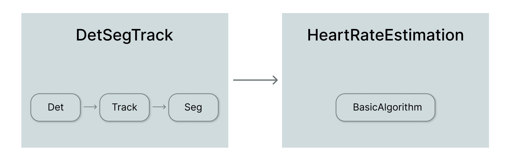

# VisPulse

The purpose of VisPulse project is estimation of heart rate from videos on which multiple people are engaged in different physical activities. It is the part of master thesis titled *Semantic segmentation and tracking of human silhouettes on video sequences for heart rate estimation algorithm*.

The developed algorithm performs human pose estimation and tracking on video, segments face skin and estimates heart rate (HR). It was implemented by using computationally efficient methods. Because of that, algorithm is capable of operating in real-time.

## Contents

1. [Results](#results)
2. [Project structure](#project-structure)
3. [Installation](#installation)
4. [Quick Start](#quick-start-overview)
5. [Acknowledgment](#acknowledgment)

## Results

Different combinations of pose detectors and trackers were evaluated on [PoseTrack21](https://github.com/anDoer/PoseTrack21) dataset.

| Detector and tracker | mAP | HOTA |
| -------------------- | --- | ---- |
| RTMO-l + ByteTrack   | 46.2 | 35.3 |
| RTMPose-l + ByteTrack   | 47.2 | 37.9 |
| RTMPose-m + ByteTrack   | 46.4 | 37.3 |
| YOLOv8l-pose + ByteTrack   | 49.6 | 33.9 |
| YOLOv8l-pose + BoT-SORT   | - | 36.9 |
| YOLOv8m-pose + ByteTrack   | 47.4 | 34.4 |
| YOLOv8m-pose + BoT-SORT  | - | 35.2 |
| YOLOv8s-pose + ByteTrack   | 43.2 | 31.7 |

Based on evaluation results for PoseTrack21, combination of **RTMPose-m + ByteTrack** was selected. Speed reported by authors was also taken in the consideration. HR estimation was evaluated on video sequences recorded for this project. On videos, one or two people are engaged in physical activities, standing 2m from camera. Apple Watch was used to gather ground truth HR data.

Three different BVP (blood volume pulse) signal extraction methods were tested. The most simple method based on analysis of green channel turned out to be most accurate. 

| BVP singal extraction method | RMSE [bpm] | Pearson correlation |
| -------------------- | --- | ---- |
| Green channel   | 17.266 | 0.867 |
| CHROM   | 23.899 | 0.604 |
| POS   | 22.245 | 0.753 |

## Project structure

Files with prefix *main_* are main project files. They are responsible for calling the main algorithm. 
- `main.py` is responsible for running algorithm for chosen video sequence,
- `main_posetrack.py` enables running algorithm for all videos from PoseTrack21 dataset,
- `main_project_videos.py` is designed specifically for video sequences recorded for this project.

`det_seg_track` directory contains code of detection, tracking and segmentation modules. In `hr` directory code of HR estimation algorithm and different BVP signal extraction methods can be found. In `eval/hr` you can find scripts for evaluation of HR results. File under `results/hr_results/vid_data.csv` contains information about video sequences recorded for this project and under `results/hr_results/gt/` ground truth HR data exported from Apple Watch can be found.

## Installation

Project was implemented and tested in WSL2 environment on Ubuntu 22.04. Miniconda was used to manage virtual envs. To create new virtual env using conda, install Miniconda and execute following command:

`conda create -n vispulse python=3.10`

After that, you can clone this repo:

`git clone https://github.com/reddog3s/VisPulse.git`

In created environment, in cloned project directory, install these dependecies:
- [MMDeploy](https://mmdeploy.readthedocs.io/en/latest/get_started.html),
- [MMPose](https://mmpose.readthedocs.io/en/latest/installation.html),
- [Ultralytics](https://docs.ultralytics.com/quickstart/),
- [ByteTrack](https://github.com/ifzhang/ByteTrack).

After everything was installed properly, change all occurances of `np.float` to `np.float32` in following files:

- ByteTrack/tutorials/centertrack/byte_tracker.py,
- ByteTrack/yolox/tracker/byte_tracker.py,
- ByteTrack/yolox/tracker/matching.py.

It assures that ByteTrack's code is compatible with newer versions of numpy.

## Quick Start

To run all modules on selected video, execute following command:

`python main.py --filepath path/to/my/video.MP4 --detector rtmpose-l --tracker bytetrack --segmentator mobile_sam --hr_method POS`

It uses RTMPose-l model for person estiamtion, ByteTrack for tracking and MobileSAM for segmentation. Later heart rate estimation is performed using POS algorithm. Modify this command according to your needs.

## Acknowledgment

The implementation is based on several sources, including:
- [MMDeploy](https://github.com/open-mmlab/mmdeploy) and [MMPose](https://github.com/open-mmlab/mmpose)
- [Ultralytics](https://github.com/ultralytics)
- [ByteTrack](https://github.com/ifzhang/ByteTrack)
- [rPPG-Toolbox](https://github.com/ubicomplab/rPPG-Toolbox)
- Apple Health app data export: https://github.com/vinayakgaur/Apple-Health-Data-Analysis.git
- Bland-Altman analysis: https://rowannicholls.github.io/python/statistics/agreement/bland_altman.html

Other references can be found in master thesis.